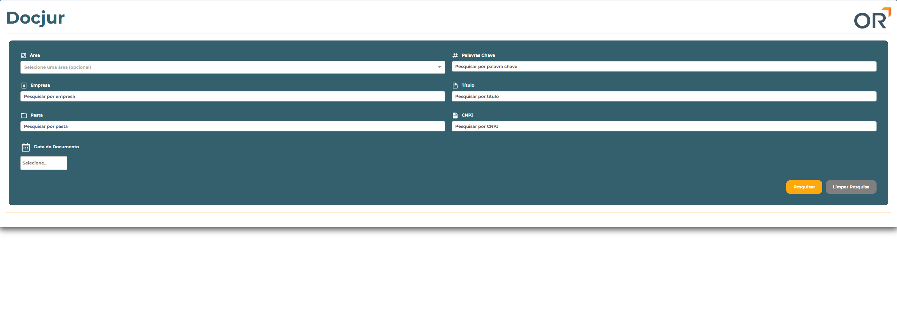
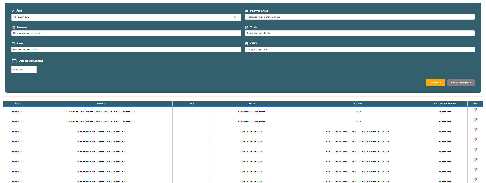
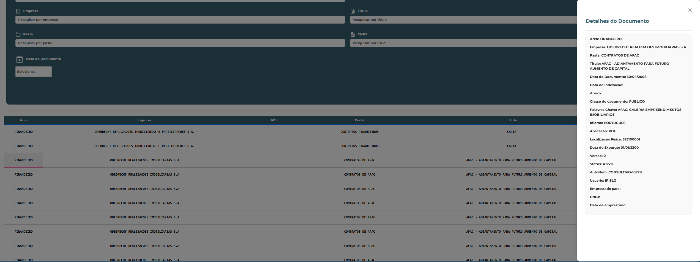

# 📁 Docjur – Aplicação de Gestão Documental

## 📝 Descrição

**Docjur** é uma aplicação web desenvolvida em Python com o framework Dash. Permite filtrar, visualizar e consultar documentos com base em **CNPJ**, **área**, **títulos**, **palavras-chave**, **data**, entre outros critérios.

Seu objetivo é facilitar a gestão documental por meio de uma interface intuitiva, filtros avançados e visualização direta dos registros armazenados num arquivo .DB (Oriundo e reogarnizado de um Sistema Legado).

---

## ⚙️ Tecnologias Utilizadas

- **Python**
- **Dash** + **Dash Bootstrap Components**
- **SQLite** – Banco de dados leve e embutido
- **Pandas** – Manipulação de dados
- **Git/GitHub** – Versionamento e colaboração

---

## 🛠️ Requisitos

- Python instalado → [https://www.python.org](https://www.python.org)
- Ambiente virtual ativo

---

## 🚀 Instalação

#### 1. Clone o repositório:

```bash
git clone https://github.com/paesdj1987/docjur.git
cd docjur
```

#### 2. Crie e ative o ambiente virtual:

- python -m venv venv (Linux/Mac)
- source venv/bin/activate (Linux/Mac)

- python -m venv venv (Windows)
- venv\Scripts\activate (Windows)

#### 3. Instale as dependências:

- pip install -r requirements.txt

#### 4. Execute a aplicação:

- python app.py

## 🖼️ Demonstrações da Interface
🔎 Tela Inicial de Pesquisa
Interface amigável com filtros por área, empresa, pasta, palavra-chave, título, CNPJ e data do documento.




## 📄 Resultados com filtros aplicados e painel lateral com detalhes do documento
Apresenta todos os dados armazenados no banco com visualização estruturada.




## 📑 Tabela completa com links para documentos e filtro refinado
Lista todos os documentos com ícone de acesso ao PDF.




## 📂 Estrutura do Projeto

```text
docjur/
├── app.py               # Arquivo principal para executar a aplicação
├── layout.py            # Layout da interface com Dash
├── callbacks.py         # Callbacks para a lógica interativa
├── arquivo.db           # Banco de dados SQLite com os documentos
├── requirements.txt     # Dependências da aplicação
├── README.md            # Documentação do projeto
├── assets/
│   ├── custom.css       # Estilização personalizada
│   ├── logoOR.png       # Logo da empresa
│   ├── pdflogo.png      # Ícone de visualização PDF
│   └── images/
│       ├── img_1.png
│       ├── img_2.png
│       └── img_3.png
```

## 👤 Autor
Desenvolvido por João Paes
🔗 github.com/paesdj1987
